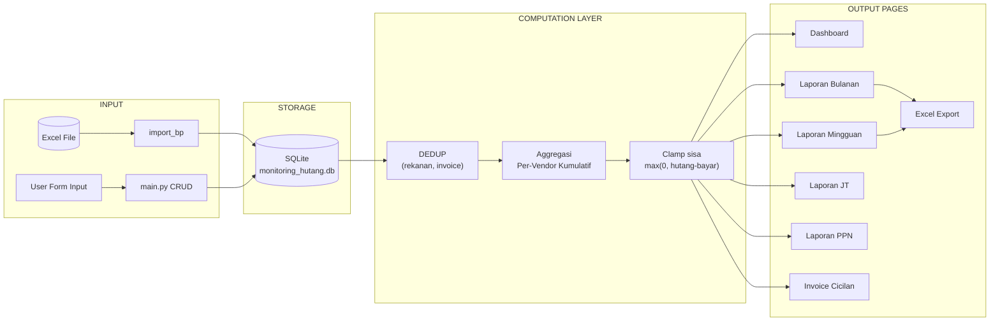
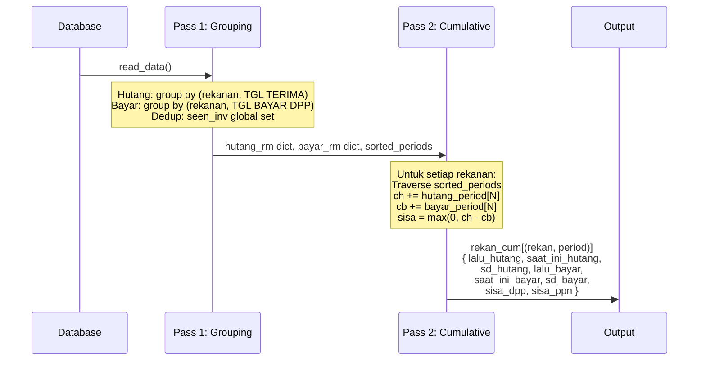
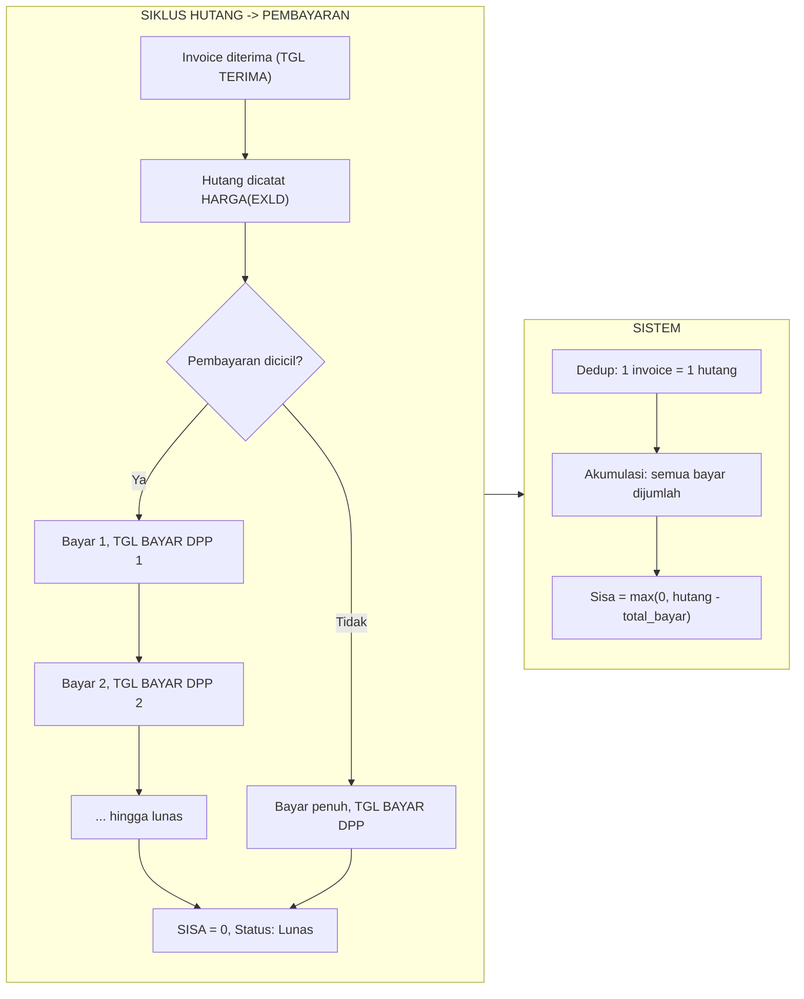
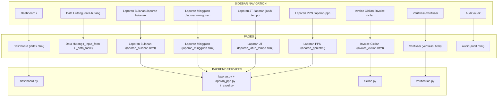

# Dokumentasi Sistem — Monitoring Hutang Reguler

## Daftar Isi

1. [Arsitektur Aplikasi](#1-arsitektur-aplikasi)
2. [Stack Teknologi](#2-stack-teknologi)
3. [Database & Kolom](#3-database--kolom)
4. [Aturan Perhitungan Keuangan](#4-aturan-perhitungan-keuangan)
5. [Halaman & Metodologi](#5-halaman--metodologi)
6. [Log Perbaikan](#6-log-perbaikan)
7. [Glosarium](#7-glosarium)
8. [Lampiran: Ringkasan Angka Validasi](#8-lampiran-ringkasan-angka-validasi)

---

## 1. Arsitektur Aplikasi

Aplikasi menggunakan pola **Model-View-Controller (MVC)** ringan dengan Flask.

```
app.py                     → Entry point (app factory, route registration)
│
├── controllers/           → Route handlers (Blueprints)
│   ├── main.py            →   Dashboard, Data Hutang, CRUD, Audit, API
│   ├── laporan_bp.py      →   Laporan Bulanan, Mingguan, JT, PPN + Excel export
│   ├── verification_bp.py →   Verifikasi data, duplicate/invoice conflict
│   ├── cicilan_bp.py      →   Invoice Cicilan
│   └── import_bp.py       →   Import Excel
│
├── services/              → Business logic (model layer — pure computation)
│   ├── dashboard.py       →   Aggregasi dashboard (KPI, aging, chart)
│   ├── laporan.py         →   Laporan Bulanan, Mingguan, JT, Excel export
│   ├── laporan_ppn.py     →   Laporan PPN bulanan
│   ├── jt_excel.py        →   Excel export Jatuh Tempo
│   ├── cicilan.py         →   Deteksi invoice cicilan
│   ├── verification.py    →   Validasi duplikat rekanan & conflict invoice
│   └── excel_import.py    →   Parser & migrasi dari file Excel
│
├── templates/             → Jinja2 HTML views
│   ├── base.html          →   Layout utama (sidebar, topbar, flash messages)
│   ├── index.html         →   Dashboard
│   ├── laporan_bulanan.html
│   ├── laporan_mingguan.html
│   ├── laporan_jatuh_tempo.html
│   ├── laporan_ppn.html
│   ├── invoice_cicilan.html
│   ├── verifikasi.html
│   └── partials/          →   Komponen reusable (_data_table.html, dll)
│
├── db.py                  → SQLite koneksi, query, migrasi kolom
├── constants.py           → Definisi kolom, helper (safe_float, effective_invoice, calc_sisa)
├── db_audit.py            → Database audit trail
└── db_ignore.py           → Database ignored-rows untuk verifikasi
```

**Alur data end-to-end:**



---

## 2. Stack Teknologi

| Komponen | Teknologi |
|----------|-----------|
| Backend | Python 3.13 + Flask 3.x |
| Database | SQLite 3 (single file `monitoring_hutang.db`) |
| Template | Jinja2 (extends `base.html`) |
| Frontend | Vanilla JS + Bootstrap Icons + CSS Grid/Flexbox |
| Excel Export | `xlsxwriter` |
| Excel Import | `openpyxl` |
| Database Audit | `db_audit.py` (SQLite terpisah `monitoring_hutang_audit.db`) |

---

## 3. Database & Kolom

**File**: `db.py`
**Database**: `monitoring_hutang.db` — satu tabel: `hutang`

Semua kolom disimpan sebagai `TEXT`, dikonversi ke `float`/`int` saat diproses.

### 3.1 Kolom Input

| Kolom | Tipe | Keterangan |
|-------|------|------------|
| `R` | TEXT | Nomor urut (auto-increment) |
| `TGL TERIMA BERKAS` | DATE | Tanggal berkas diterima |
| `NAMA LEVELANSIR / REKANAN` | TEXT | Nama vendor/rekanan |
| `STATUS TERHADAP DPP` | TEXT | `Lunas` / `Belum Lunas` |
| `STATUS TERHADAP PPN` | TEXT | `Ada PPN` / `Tidak ada PPN` / `Ditanggung Rekanan` |
| `KETERANGAN PPN` | TEXT | Catatan PPN |
| `NO INVOICE INTERNAL` | TEXT | **Nomor invoice internal** — prioritas untuk dedup |
| `NO INVOICE` | TEXT | Nomor invoice dari vendor |
| `NO PO / KONTRAK` | TEXT | Nomor PO/Kontrak |
| `TGL INV` | DATE | Tanggal invoice |
| `TGL TERIMA` | DATE | **Tanggal terima berkas** — digunakan sebagai periode hutang |
| `JTH TEMPO` | DATE | Jatuh tempo |
| `DESKRIPSI` | TEXT | Uraian pekerjaan |
| `KODE BIAYA` | TEXT | Kode biaya |
| `VOLUME PROGRESS` | NUM | Volume progress (desimal, bukan currency) |
| `HARGA SATUAN` | NUM | Harga satuan (currency) |
| `HARGA (EXLD)` | NUM | **Harga total sebelum PPN** (currency) |
| `POT. RETENSI` | NUM | Potongan retensi (currency) |
| `POT. PPH` | NUM | Potongan PPH (currency) |
| `PPN` | NUM | **PPN** (currency) |
| `TOTAL (INCLD)` | NUM | **Total termasuk PPN** (currency) |
| `NO SERI FAKTUR PAJAK` | TEXT | Nomor seri faktur pajak |
| `TGL FAKTUR PAJAK` | DATE | Tanggal faktur pajak |
| `PEMBAYARAN DPP VIA DIVISI` | TEXT | Divisi pembayar |
| `NO BUKTI BAYAR DPP` | TEXT | **Nomor bukti bayar DPP** — identitas pembayaran |
| `TGL BAYAR DPP` | DATE | Tanggal bayar DPP |
| `PEMBAYARAN PPN VIA` | TEXT | Via pembayaran PPN |
| `NO BUKTI BAYAR PPN` | TEXT | Nomor bukti bayar PPN |
| `TGL BAYAR PPN` | DATE | Tanggal bayar PPN |
| `PEMBAYARAN DPP` | NUM | **Jumlah pembayaran DPP** (currency) |
| `PEMBAYARAN POT. PPH` | NUM | Pembayaran pot. PPH (currency) |
| `NILAI YG DITERIMA VENDOR` | NUM | Nilai yang diterima vendor (currency) |
| `PEMBAYARAN PPN` | NUM | **Pembayaran PPN** (currency) |
| `KATEGORI` | TEXT | Kategori (BUA, Material, Jasa, dll — via `config.json`) |

### 3.2 Kolom Auto-Calculate

Kolom berikut dihitung otomatis oleh `calc_sisa()` di `constants.py` saat input/edit:

| Kolom | Rumus |
|-------|-------|
| `SISA HUTANG (INCLD PPN)` | `max(0, TOTAL(INCLD) - PEMBAYARAN DPP - PEMBAYARAN PPN)` |
| `SISA HUTANG DPP` | `max(0, HARGA(EXLD) - PEMBAYARAN DPP)` |
| `SISA HUTANG PPN` | `max(0, PPN - PEMBAYARAN PPN)` |
| `BLM JATUH TEMPO` | `1` jika STATUS=Belum Lunas DAN JTH TEMPO > hari ini |
| `1-30 HARI` | `1` jika overdue 1-30 hari |
| `31-60 HARI` | `1` jika overdue 31-60 hari |
| `61-90 HARI` | `1` jika overdue 61-90 hari |
| `LEBIH 90 HARI` | `1` jika overdue >90 hari |

Semua nilai currency dibulatkan ke Rupiah penuh (*round half away from zero*, seperti Excel).

### 3.3 Alur Data Detail: dari Database ke Halaman

```mermaid
flowchart TD
    DB[("monitoring_hutang.db")] -->|read_data()| Raw["Raw Data (list of dicts)"]

    Raw --> DedupCheck{Invoice sudah<br/>pernah terlihat?}
    DedupCheck -->|Belum| Keep["HARGA(EXLD) = value asli<br/>TOTAL(INCLD) = value asli"]
    DedupCheck -->|Ya, duplikat| Zero["HARGA(EXLD) = 0<br/>TOTAL(INCLD) = 0<br/>PPN = 0<br/>(payment tetap diakumulasi)"]

    Keep --> Group[Group by Rekanan + Periode]
    Zero --> Group

    Group --> Pass1["Pass 1: hutang_rm (TGL TERIMA)<br/>bayar_rm (TGL BAYAR DPP)"]
    Pass1 --> Pass2["Pass 2: Cumulative<br/>ch: cumulative HARGA(EXLD)<br/>cb: cumulative PEMBAYARAN DPP"]
    Pass2 --> Sisa["Sisa = max(0, ch - cb) per vendor per periode"]

    Sisa -->|bulan| Bulanan["Laporan Bulanan"]
    Sisa -->|minggu| Mingguan["Laporan Mingguan"]
    Sisa -->|filter PPN| PPNPage["Laporan PPN"]
    Sisa --> ExcelOut["Excel Export"]
```

---

## 4. Aturan Perhitungan Keuangan

### 4.1 Prinsip Dasar

```
HUTANG = HARGA (EXLD) = nilai barang/jasa sebelum PPN
BAYAR  = PEMBAYARAN DPP = jumlah yang sudah dibayar ke vendor
SISA   = max(0, HUTANG - BAYAR)   ← tidak boleh negatif
```

### 4.2 Deduplikasi Invoice

**Aturan emas**: Satu invoice = satu hutang. Jika invoice yang sama muncul di >1 baris (karena cicilan), nilai `HARGA (EXLD)` hanya dihitung **sekali**.

**Identity key**: `(rekanan, effective_invoice)`, di mana:

```python
def effective_invoice(row):
    """Prioritas: NO INVOICE INTERNAL -> fallback ke NO INVOICE"""
    inv_int = row.get('NO INVOICE INTERNAL')
    if inv_int:
        return inv_int
    return row.get('NO INVOICE')
```

**Global dedup**: Semua agregasi menggunakan `seen_inv` set global — artinya sebuah invoice hanya dihitung hutangnya **1x di seluruh periode** (bulanan, mingguan, PPN, JT).

**Payment tidak di-dedup**: `PEMBAYARAN DPP` selalu diakumulasi dari semua baris, karena satu invoice bisa dibayar bertahap (cicilan). Identitas pembayaran adalah `NO BUKTI BAYAR DPP`.

**Implementasi**:

- [`services/laporan.py:_build_cum()`](services/laporan.py:60-69) — baris 62: `if inv_dedup_key is None or inv_dedup_key not in seen_inv:`
- [`services/dashboard.py:_dedup_debt_rows()`](services/dashboard.py:18-38) — baris 25: `if key and key in seen:`

### 4.3 Per-Vendor Clamp

**Aturan**: Sisa DPP dihitung **per vendor**, lalu dijumlahkan — bukan dihitung dari total seluruh vendor.

```
BENAR (per-vendor clamp):
   SISA TOTAL = sum(
       max(0, vendor_A_HUTANG - vendor_A_BAYAR),
       max(0, vendor_B_HUTANG - vendor_B_BAYAR), ...

SALAH (grand clamp):
   SISA TOTAL = max(0, sum(HUTANG semua vendor) - sum(BAYAR semua vendor))
```

**Alasan**: Jika vendor A overbayar (bayar > hutang) sebesar 100jt, sisa negatif itu tidak boleh mengurangi hutang vendor B yang masih 200jt. Overpayment adalah kelebihan bayar yang harus diretur atau dikurangkan di tagihan berikutnya — bukan pengurang hutang vendor lain.

**Dampak**: Di sistem ini, terdapat 4 vendor overpay dengan total ~179jt. Menggunakan grand clamp akan mengurangi sisa hutang vendor lain, menghasilkan angka sisa total 8,939,962,437 (salah). Dengan per-vendor clamp, sisa total = 9,119,002,366 (benar).

**Implementasi**:

- [`services/dashboard.py:51-59`](services/dashboard.py:51-59) — accumulator `_vs` per vendor
- [`services/laporan.py:143`](services/laporan.py:143) — di `_build_cum`: `sisa_dpp = max(0, chx - cbp)` 
- [`services/laporan.py:604`](services/laporan.py:604) — di `_render_lbp` per vendor: `max(0, (lalu_hutang + saat_ini_hutang) - (lalu_bayar + saat_ini_bayar))`
- [`services/laporan.py:612`](services/laporan.py:612) — accumulator `t_sisa` untuk TOTAL row Excel

### 4.4 Periode Hutang vs Bayar

- **Hutang** diklasifikasikan ke periode berdasarkan **`TGL TERIMA`** (tanggal terima berkas).
- **Pembayaran** diklasifikasikan ke periode berdasarkan **`TGL BAYAR DPP`**.
- Kedua periode bisa berbeda — hutang diakui saat berkas diterima, pembayaran diakui saat uang dibayar.
- Periode bisa berupa **bulan** (YYYY-MM) atau **minggu** (YYYY-Www, Minggu-Sabtu).

### 4.5 Sisa Dinamis

Sisa DPP di setiap periode dihitung sebagai:

```
sisa_dpp(periode N) = max(0, cumulative_hutang_sd_N - cumulative_bayar_sd_N)
```

Sisa **tidak statis** — tergantung posisi periode yang dipilih. Misalnya:
- Periode Jan: hutang=500jt, bayar=200jt -> sisa=300jt
- Periode Feb: hutang=500jt (sama), bayar=400jt (akumulasi) -> sisa=100jt

### 4.6 KPI Baris vs KPI Footer

Di laporan, setiap bulan memiliki:
- **KPI** (key performance indicator) — satu set angka untuk bulan itu
- **Baris per vendor** — dijumlahkan dari semua vendor yang memiliki aktivitas

KPI `sisa_dpp` = `sum(max(0, cumulative_hutang - cumulative_bayar))` per vendor.
Footer Tabel = `sum(sisa_dpp)` dari semua baris vendor.

### 4.7 Cumulative Methodology (Pass 1 + Pass 2)



**Contoh numerik (vendor XYZ):**

```
           | Hutang   | Bayar    | sisa_dpp
           | (cum.)   | (cum.)   | max(0, H-B)
-----------+----------+----------+----------
Periode 1  | 500.000  | 200.000  | 300.000
Periode 2  | 500.000  | 500.000  |      0   <- lunas
Periode 3  | 800.000  | 500.000  | 300.000   <- ada hutang baru
```

Perhatikan: di Periode 2 sisa=0 (lunas), di Periode 3 sisa naik lagi karena ada hutang baru dari invoice berbeda.

### 4.8 Empty-Week Fallback (Mingguan)

Untuk laporan mingguan, jika suatu vendor tidak memiliki aktivitas di suatu minggu, sistem mengambil state kumulatif terakhir yang diketahui (`vendor_last`). Ini agar minggu-minggu kosong tetap menampilkan vendor dengan hutang yang masih berjalan.

### 4.9 Diagram End-to-End: dari Hutang Baru hingga Lunas



---

## 5. Halaman & Metodologi

### 5.1 Dashboard (`/` atau `/dashboard`)

**Service**: [`services/dashboard.py`](services/dashboard.py)

**Metodologi**:
- Menggunakan `_dedup_debt_rows()` (dedup per invoice)
- **SISA DPP**: Per-vendor clamp (`_vs` dict, `sum(max(0, v))`)
- **SISA PPN**: Langsung dari kolom `SISA HUTANG PPN` hasil dedup
- **Aging**: Berdasarkan `JTH TEMPO` untuk yang status `Belum Lunas`
- **Overdue list**: Top 10 overdue terbesar
- **Monthly chart**: Grup by `JTH TEMPO` month

**KPI yang ditampilkan**:
| KPI | Sumber |
|-----|--------|
| Total Tagihan | `sum(TOTAL(INCLD))` dari baris deduped |
| Total Bayar DPP | `sum(PEMBAYARAN DPP)` dari data original (semua baris) |
| SISA DPP | Per-vendor clamp |
| SISA PPN | `sum(SISA HUTANG PPN)` dari baris deduped |
| % Lunas DPP | `total_bayar_dpp / total_harga_excl * 100` |

### 5.2 Laporan Bulanan (`/laporan-bulanan`)

**Service**: [`services/laporan.py:build_laporan_data()`](services/laporan.py:172)

**Metodologi**:
- Grup by month dari `TGL TERIMA` (untuk hutang) dan `TGL BAYAR DPP` (untuk bayar)
- Menggunakan `_build_cum()` dengan global dedup
- Setiap bulan punya `rekanan_list` (vendor yang punya aktivitas s.d. bulan itu)
- Vendor dengan `sd_hutang=0` dan `sd_bayar=0` tetap muncul (skip di Excel)

**Per vendor**:
| Field | Rumus |
|-------|-------|
| `lalu_hutang` | Hutang kumulatif sebelum bulan ini |
| `saat_ini_hutang` | Hutang baru di bulan ini |
| `sd_hutang` | Hutang kumulatif s.d. bulan ini |
| `lalu_bayar` | Bayar kumulatif sebelum bulan ini |
| `saat_ini_bayar` | Bayar baru di bulan ini |
| `sd_bayar` | Bayar kumulatif s.d. bulan ini |
| `sisa_dpp` | `max(0, sd_hutang - sd_bayar)` |

**Excel export**: [`build_excel_export()`](services/laporan.py:685) -> `_render_lbp()`

### 5.3 Laporan Mingguan (`/laporan-mingguan`)

**Service**: [`services/laporan.py:build_mingguan_data()`](services/laporan.py:274)

**Metodologi**: Sama seperti bulanan, tapi periode = **Minggu-Sabtu** (Sunday-start week).
- Week key: `YYYY-Www` (menggunakan ISO year/week dari Tuesday dalam minggu tersebut untuk sorting)
- Empty-week fallback: vendor tanpa aktivitas di suatu minggu tetap muncul dengan state kumulatif terakhir

### 5.4 Laporan Jatuh Tempo (`/laporan-jatuh-tempo`)

**Service**: [`services/laporan.py:build_jatuh_tempo_data()`](services/laporan.py:742)

**Metodologi**:
- Grup by **JTH TEMPO** month (bukan TGL TERIMA)
- Dedup global dengan key `(rekanan, effective_invoice)`
- Sisa DPP dinamis: `max(0, harga_excl - dp)` per invoice
- **Overdue days**: `hari_lebih = today - JTH TEMPO` (jika masih punya sisa), atau `tgl_bayar - JTH TEMPO` (jika sudah lunas)

### 5.5 Laporan PPN (`/laporan-ppn`)

**Service**: [`services/laporan_ppn.py:build_ppn_data()`](services/laporan_ppn.py:13)

**Metodologi**:
- Filter: hanya row dengan `STATUS TERHADAP PPN != 'Tidak ada PPN'`
- Menggunakan `_build_cum()` yang sama dengan laporan DPP
- Field: `lalu_ppn`, `saat_ini_ppn`, `sd_ppn`, `lalu_bayar_ppn`, `saat_ini_bayar_ppn`, `sd_bayar_ppn`, `sisa_ppn`

### 5.6 Invoice Cicilan (`/invoice-cicilan`)

**Service**: [`services/cicilan.py`](services/cicilan.py)

**Metodologi**:
- Grup data by `(rekanan, effective_invoice)`
- Filter: hanya grup dengan `row_count > 1` (invoice yang muncul di >1 baris)
- `harga_excl`: diambil dari baris pertama (deduped)
- `total_bayar_dpp`: sum dari semua baris
- `sisa_dpp`: `max(0, harga_excl - total_bayar_dpp)`

### 5.7 Verifikasi Data (`/verifikasi`)

**Service**: [`services/verification.py`](services/verification.py)

**Fitur**:
- **Duplicate rekanan**: Deteksi nama rekanan yang mirip (normalisasi: lowercase, hapus PT/CV/space)
- **Invoice-rekanan conflict**: Invoice yang sama tercatat atas rekanan berbeda
- **Incomplete data**: Baris yang missing field penting

### 5.8 Diagram Halaman & Navigasi



---

## 6. Log Perbaikan

### 6.1 Dashboard SISA DPP - Grand Clamp ke Per-Vendor Clamp

**Masalah**: KPI dashboard SISA DPP (8,939,962,437) tidak sama dengan Laporan Bulanan (9,119,002,366).

**Penyebab**: Dashboard menggunakan `max(0, total_harga - total_bayar)` (grand clamp), sementara laporan bulanan menggunakan per-vendor clamp.

**Fix**: [`services/dashboard.py:51-59`](services/dashboard.py:51-59) — accumulator per vendor.

**Dampak**: Selisih 179jt = overpayment dari 4 vendor (HASPAN, PT. JASHEN MITRA SINERGI, PT. SINAR KENCANA DURI, PT. TRIFZA SAFINDO UTAMA) yang sebelumnya mengurangi sisa vendor lain.

### 6.2 Excel Export TOTAL Row - Grand Clamp ke Per-Vendor Clamp

**Masalah**: Total SISA DPP di Excel export menggunakan grand clamp yang sama.

**Fix**: [`services/laporan.py:575-612`](services/laporan.py:575-612) — menambahkan accumulator `t_sisa` per vendor, menggunakan `t_sisa` di baris TOTAL (line 676).

### 6.3 Global Deduplikasi Invoice

**Masalah**: Invoice yang muncul di >1 baris (cicilan) dihitung hutangnya berkali-kali.

**Fix**: Implementasi `seen_inv` global di semua agregasi path.

### 6.4 HUTANG S/D SAAT INI vs Database Raw

**Fakta**: Database raw `HARGA (EXLD)` = 13,521,576,135, website = 13,342,536,206.

**Penyebab**: Deduplikasi global — 179,039,929 adalah total `HARGA (EXLD)` dari baris duplikat yang difilter. Ini benar karena setiap invoice hanya dihitung hutangnya sekali.

---

## 7. Glosarium

| Istilah | Definisi |
|---------|----------|
| **DPP** | Dasar Pengenaan Pajak = `HARGA (EXLD)` |
| **PPN** | Pajak Pertambahan Nilai |
| **PPH** | Pajak Penghasilan (Pasal 23/4 ayat 2) |
| **SISA DPP** | Hutang pokok yang belum dibayar = `max(0, DPP - PEMBAYARAN DPP)` |
| **Grand clamp** | `max(0, sum(debt_all) - sum(payment_all))` — **tidak digunakan** |
| **Per-vendor clamp** | `sum(max(0, debt_vendor - payment_vendor))` — **standar yang digunakan** |
| **Deduplikasi** | Proses memfilter baris duplikat berdasarkan `(rekanan, invoice)` |
| **Cumulative methodology** | Hutang & bayar diakumulasi per vendor secara kronologis, sisa dihitung dari total kumulatif |
| **`_build_cum()`** | Fungsi inti di `laporan.py`: Pass 1 (grouping) + Pass 2 (kumulatif) |
| **`effective_invoice()`** | Fungsi yang mengembalikan identitas invoice: `NO INVOICE INTERNAL` jika ada, fallback ke `NO INVOICE` |
| **Invoice Cicilan** | Invoice yang memiliki >1 baris pembayaran (bisa dicicil) |
| **Overpayment** | Kondisi di mana total pembayaran > total hutang untuk suatu vendor |

---

## 8. Lampiran: Ringkasan Angka Validasi

| Metrik | Nilai | Keterangan |
|--------|-------|------------|
| Total HARGA (EXLD) raw DB | 13,521,576,135 | Semua baris termasuk duplikat |
| Total HARGA (EXLD) setelah dedup | 13,342,536,206 | Setelah filter invoice duplikat |
| Baris duplikat (cicilan) | 179,039,929 | Invoice yang muncul >1 baris |
| Total PEMBAYARAN DPP (semua baris) | 4,402,573,769 | Akumulasi semua pembayaran |
| **SISA DPP (per-vendor clamp)** | **9,119,002,366** | **Angka yang benar** |
| Grand clamp (salah) | 8,939,962,437 | Overpayment 179jt mengurangi hutang |
| Selisih | 179,039,929 | = 4 vendor overpay |
| Vendor overpay terbesar | PT. TRIFZA SAFINDO UTAMA | ~100M overpay |
| Jumlah vendor dengan sisa > 0 | 27 | Dari 31 vendor total |
| Jumlah vendor overpay | 4 | Bayar > hutang |
| KPI % Lunas DPP | 33% | 4,402,573,769 / 13,342,536,206 |

---

*Dokumen ini diperbarui: 22 Juli 2026*
