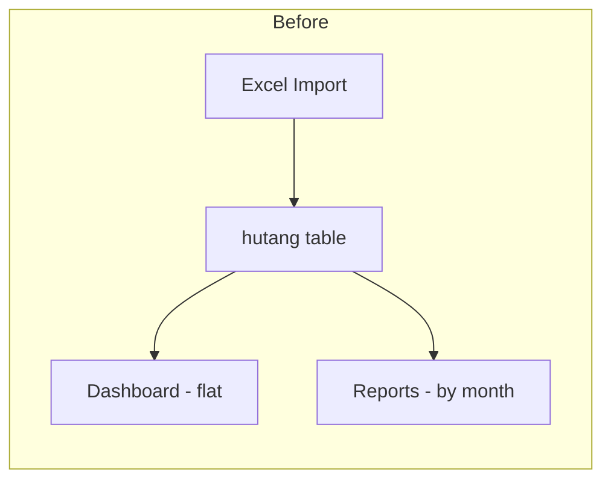
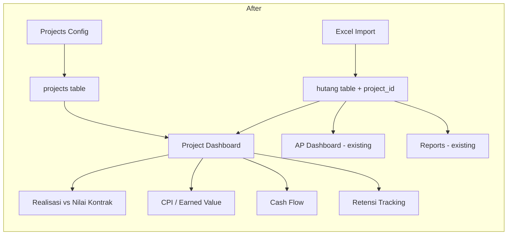
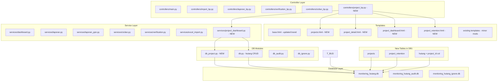

# Transformation Plan: Debt Tracker → Project Financial Monitoring System

## 1. Current Architecture Summary

```
Single SQLite DB (monitoring_hutang.db)
  └─ hutang table (45 TEXT columns, _row PK)
      ├─ Invoice data (NO INVOICE, TGL INV, DESKRIPSI, etc.)
      ├─ Payment tracking (PEMBAYARAN DPP/PPN, TGL BAYAR, etc.)
      ├─ Tax fields (PPN, POT. PPH, POT. RETENSI)
      ├─ Auto-calculated (SISA HUTANG, aging buckets)
      └─ Metadata (KATEGORI, KETERANGAN, KODE BIAYA)

Separate DBs:
  ├─ monitoring_hutang_audit.db (audit_log, audit_snapshots, audit_originals)
  └─ monitoring_hutang_ignore.db (ignored verification rows)

Flask MVC:
  ├─ controllers/ (5 blueprints: main, import, laporan, verification, cicilan)
  ├─ services/    (dashboard, laporan, laporan_ppn, cicilan, verification, excel_import)
  └─ templates/   (base + 10 page templates + 3 partials)
```

**Key limitation:** No concept of "projects" — everything is flat invoice-level data grouped only by KATEGORI and REKANAN.

---

## 2. Transformation Strategy

### Philosophy: **Additive, Not Destructive**

The existing hutang tracking works well. We **layer project-level concepts on top** rather than rewriting the core. The `hutang` table stays as-is (it IS the cost/AP ledger). We add:

1. `projects` table project metadata
2. A `project_id` column on `hutang` to link invoices to projects
3. New service layers that aggregate hutang data at project level
4. New dashboard + report pages for project-level financial health

### Data Flow (Before vs After)





---

## 3. Database Schema Changes

### 3a. New Table: `projects`

```sql
CREATE TABLE projects (
    id            INTEGER PRIMARY KEY AUTOINCREMENT,
    kode_proyek   TEXT UNIQUE NOT NULL,   -- e.g. PRJ-001
    nama_proyek   TEXT NOT NULL,
    lokasi        TEXT,
    pemilik       TEXT,                   -- owner/client name
    nilai_kontrak REAL DEFAULT 0,        -- total contract value
    tgl_mulai     TEXT,                   -- YYYY-MM-DD
    tgl_selesai   TEXT,                   -- planned end
    status        TEXT DEFAULT 'Aktif',   -- Aktif / Selesai / Ditangguhkan
    catatan       TEXT,
    created_at    TEXT DEFAULT (datetime('now','localtime'))
);
```

### 3b. ~New Table: `project_budget` (RAB line items)~ — DIBATALKAN

> **Fitur anggaran/RAB dihapus** dan tidak lagi tersedia. Tabel `project_budget`
> dibuang; progres proyek kini diukur terhadap **Nilai Kontrak**, bukan anggaran.
> Data lama (7 item RAB) diarsipkan di `Dokumentasi/backup_project_budget.csv`.

### 3c. Add Column to `hutang`

```sql
ALTER TABLE hutang ADD COLUMN project_id TEXT DEFAULT '';
```

> Using TEXT to stay consistent with the existing all-TEXT schema. Stored as string integer. Empty = unassigned.

### 3d. New Table: `project_retention` (Piutang Retensi tracking)

```sql
CREATE TABLE project_retention (
    id          INTEGER PRIMARY KEY AUTOINCREMENT,
    project_id  INTEGER NOT NULL REFERENCES projects(id),
    rekanan     TEXT NOT NULL,
    no_invoice  TEXT,
    nilai_retensi REAL DEFAULT 0,
    tgl_potong  TEXT,                    -- when retention was withheld
    tgl_kembali TEXT,                    -- when returned (null = outstanding)
    status      TEXT DEFAULT 'Ditahan',  -- Ditahan / Dikembalikan
    catatan     TEXT
);
```

### Why NOT a new `realisasi` table?

The `hutang` table already IS the realisasi (actual cost) ledger. Each invoice row represents actual spend. We just need to link it to a project via `project_id` and aggregate by KATEGORI to compare against the contract value (`nilai_kontrak`).

---

## 4. Feature Breakdown

### Feature 1: Project Management (CRUD)

- **What:** Create/edit/delete project identity (tanpa anggaran)
- **Files touched:**
  - NEW [`db_project.py`](db_project.py) — project + retention DB operations
  - NEW [`controllers/project_bp.py`](controllers/project_bp.py) — CRUD routes
  - NEW [`templates/projects.html`](templates/projects.html) — project list page
  - NEW [`templates/project_detail.html`](templates/project_detail.html) — single project identity view
  - MOD [`app.py`](app.py) — register new blueprint
  - MOD [`templates/base.html`](templates/base.html) — add sidebar nav item

### Feature 2: Link Invoices to Projects

- **What:** Add project_id column to hutang, project selector in forms, auto-assign on import
- **Files touched:**
  - MOD [`constants.py`](constants.py) — add `project_id` to COLUMNS, FORM_FIELDS
  - MOD [`db.py`](db.py) — migration adds column
  - MOD [`templates/partials/_input_form.html`](templates/partials/_input_form.html) — project dropdown
  - MOD [`templates/partials/_data_table.html`](templates/partials/_data_table.html) — show project column
  - MOD [`controllers/main.py`](controllers/main.py) — pass projects list to template
  - MOD [`services/excel_import.py`](services/excel_import.py) — optional project assignment on import

### Feature 3: Project Dashboard (Realisasi vs Nilai Kontrak)

- **What:** Per-project dashboard showing actual spend against contract value, PPh, cash flow, retensi
- **Note:** Rencana awal "Budget vs Realisasi" dibatalkan — fitur anggaran/RAB dihapus.
- **Files touched:**
  - NEW [`services/project_dashboard.py`](services/project_dashboard.py) — aggregation logic
  - NEW [`templates/project_dashboard.html`](templates/project_dashboard.html) — the dashboard UI
  - MOD [`controllers/project_bp.py`](controllers/project_bp.py) — dashboard route

**Key metrics calculated:**
| Metric | Formula |
|--------|---------|
| Total Realisasi | SUM of hutang HARGA EXLD where project_id matches |
| Nilai Kontrak | From projects.nilai_kontrak |
| Progres Realisasi | Realisasi / Nilai Kontrak \* 100 |
| Sisa Hutang per Project | SUM of SISA HUTANG DPP |

### Feature 4: Cash Flow View

- **What:** Monthly cash in (payments received) vs cash out (payments made) per project
- **Files touched:**
  - ADD to [`services/project_dashboard.py`](services/project_dashboard.py) — cash flow builder
  - ADD to [`templates/project_dashboard.html`](templates/project_dashboard.html) — cash flow chart/table

**Data source:** Existing hutang columns:

- Cash out = PEMBAYARAN DPP (grouped by TGL BAYAR DPP month)
- Outstanding = SISA HUTANG DPP (future cash need)

### Feature 5: Retensi Tracking

- **What:** Tampilkan potongan retensi proyek, dikelompokkan per rekanan (read-only)
- **Files touched:**
  - ADD [`db_project.py`](db_project.py) — `get_retensi_rows()` (agregasi otomatis)
  - NEW [`templates/project_retention.html`](templates/project_retention.html) — daftar retensi read-only
  - ADD [`controllers/project_bp.py`](controllers/project_bp.py) — route `list_retention`
- **Catatan:** Input retensi manual **dihapus**. Tidak ada tabel `project_retention`; seluruh nilai diturunkan otomatis dari `POT. RETENSI`.

**Data source:** Kolom `POT. RETENSI` pada tabel `hutang` — satu-satunya sumber kebenaran. Perubahan nilai dilakukan lewat invoice yang bersangkutan.

### Feature 6: PPh Final Tracking Enhancement

- **What:** Add golongan-aware PPh rate display (2%/3%/4%/6%)
- **Files touched:**
  - ADD to [`templates/project_dashboard.html`](templates/project_dashboard.html) — PPh summary card
  - ADD to [`services/project_dashboard.py`](services/project_dashboard.py) — PPh aggregation

**Data source:** Existing `POT. PPH` column. Rate = POT. PPH / HARGA EXLD \* 100.

### Feature 7: Branding Update

- **What:** Rename app from "Monitoring Hutang" to "Project Financial Monitoring System"
- **Files touched:**
  - MOD [`app.py`](app.py:81) — print statement
  - MOD [`templates/base.html`](templates/base.html) — sidebar brand, page titles
  - MOD all template `` — update titles
  - MOD [`templates/import.html`](templates/import.html) — references to old name

---

## 5. Architecture Diagram



---

## 6. Sidebar Navigation (Updated)

```
┌─────────────────────────┐
│ 🏗️ Project Financial    │
│    Monitoring System    │
├─────────────────────────┤
│ 📊 Dashboard            │  ← existing AP dashboard
│ 📋 Data Hutang          │  ← existing invoice table
│ 🏢 Proyek               │  ← NEW: project list
│ 📈 Dashboard Proyek     │  ← NEW: project financial dashboard
│ ─────────────────────── │
│ 📝 Input Data           │  ← existing (hidden toggle)
│ 📥 Import               │  ← existing
│ ✅ Verifikasi           │  ← existing
│ 💳 Invoice Cicilan      │  ← existing
│ 📜 Audit                │  ← existing
│ ─────────────────────── │
│ LAPORAN                 │
│   📄 Bulanan DPP        │  ← existing
│   📄 Mingguan DPP       │  ← existing
│   📄 Jatuh Tempo        │  ← existing
│   📄 PPN Bulanan        │  ← existing
└─────────────────────────┘
```

---

## 7. Implementation Phases

### Phase 1: Foundation (DB + Project CRUD)

1. Create `db_project.py` projects/retention table init + CRUD
2. Add `project_id` column to hutang via migration in `db.py`
3. Update `constants.py` — add project_id to COLUMNS
4. Create `controllers/project_bp.py` with basic CRUD routes
5. Create `templates/projects.html` — project list page
6. Create `templates/project_detail.html` - create/edit project identity
7. Register blueprint in `app.py`
8. Update sidebar in `base.html`

### Phase 2: Link Invoices to Projects

9. Add project dropdown to `_input_form.html`
10. Add project column to `_data_table.html`
11. Update `controllers/main.py` to pass project list
12. Add project filter to data table
13. Update import flow to optionally assign project_id

### Phase 3: Project Financial Dashboard

14. Create `services/project_dashboard.py` - realisasi vs nilai kontrak aggregation
15. Create `templates/project_dashboard.html` — KPI cards, variance table, category breakdown
16. Add CPI gauge/indicator
17. Add cash flow summary (monthly in/out table)
18. Add PPh summary card
19. Add retensi outstanding summary

### Phase 4: Retention Management

20. Add retention route project_bp (read-only)
21. Create `templates/project_retention.html` (read-only, tanpa form input)
22. Agregasi retensi otomatis dari POT. RETENSI (`get_retensi_rows`)
23. (Dibatalkan) Retention aging/alerts — butuh pelacakan status pengembalian

### Phase 5: Branding & Polish

24. Rename all "Monitoring Hutang" → "Project Financial Monitoring"
25. Update page titles across all templates
26. Update sidebar brand icon and text
27. Ensure consistent premium styling on all new pages

---

## 8. What We Are NOT Doing (YAGNI)

- ❌ Multi-user auth / RBAC — single-user app, not needed yet
- ❌ Separate realisasi table — hutang IS the realisasi ledger
- ❌ PSAK 72 revenue recognition — this is a cost monitoring tool, not accounting software
- ❌ Gantt chart / project scheduling — out of scope for financial monitoring
- ❌ Separate cash flow table — derived from existing payment data
- ❌ New database file — use existing `monitoring_hutang.db` for new tables

---

## 9. Risk Mitigation

| Risk                         | Mitigation                                                        |
| ---------------------------- | ----------------------------------------------------------------- |
| Existing Excel import breaks | project_id defaults to empty string; no existing flow changes     |
| Audit DB references break    | project_id added to COLUMNS list, audit snapshots auto-include it |
| Large dataset performance    | SQLite handles the scale; indexes on project_id                   |
| Backward compatibility       | All new features are additive; existing pages work unchanged      |

---

## 10. File Change Summary

| Action | File                                  | Scope                                       |
| ------ | ------------------------------------- | ------------------------------------------- |
| NEW | `db_project.py` | Projects + retention DB layer |
| NEW    | `controllers/project_bp.py`           | Project CRUD + dashboard routes             |
| NEW | `services/project_dashboard.py` | Realisasi vs nilai kontrak + cash flow |
| NEW    | `templates/projects.html`             | Project list page                           |
| NEW | `templates/project_detail.html` | Project create/edit form |
| NEW    | `templates/project_dashboard.html`    | Project financial dashboard                 |
| NEW    | `templates/project_retention.html`    | Retention management page                   |
| MOD    | `app.py`                              | Register project blueprint, update branding |
| MOD    | `db.py`                               | Add project_id column migration             |
| MOD    | `constants.py`                        | Add project_id to COLUMNS + related lists   |
| MOD    | `templates/base.html`                 | Sidebar nav items, brand rename             |
| MOD    | `templates/partials/_input_form.html` | Project dropdown selector                   |
| MOD    | `templates/partials/_data_table.html` | Project column + filter                     |
| MOD    | `controllers/main.py`                 | Pass project list to templates              |
| MOD    | `services/excel_import.py`            | Optional project assignment                 |
| MOD    | All template titles                   | Brand rename                                |
